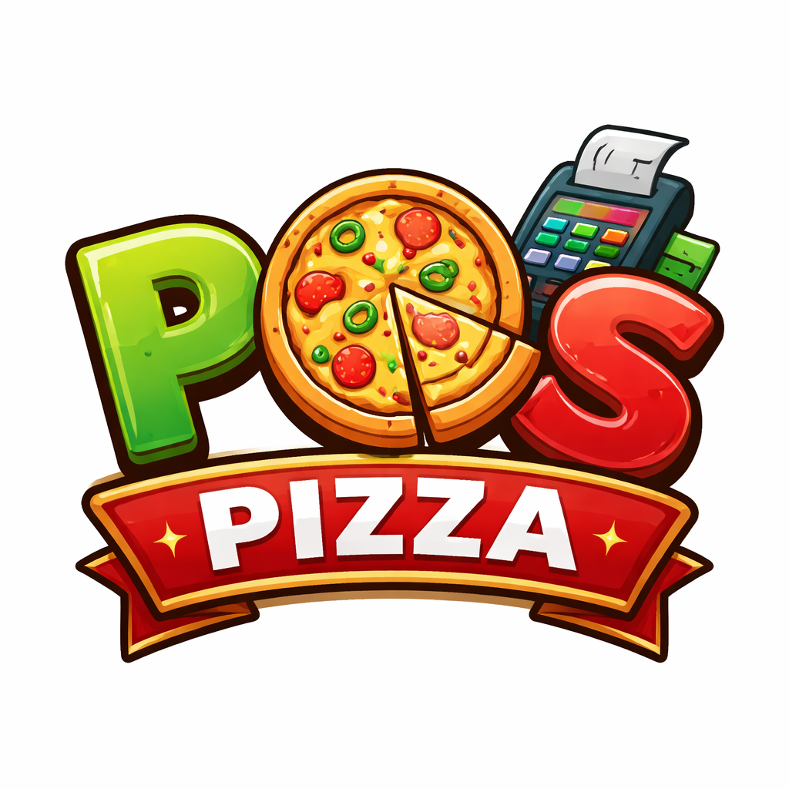
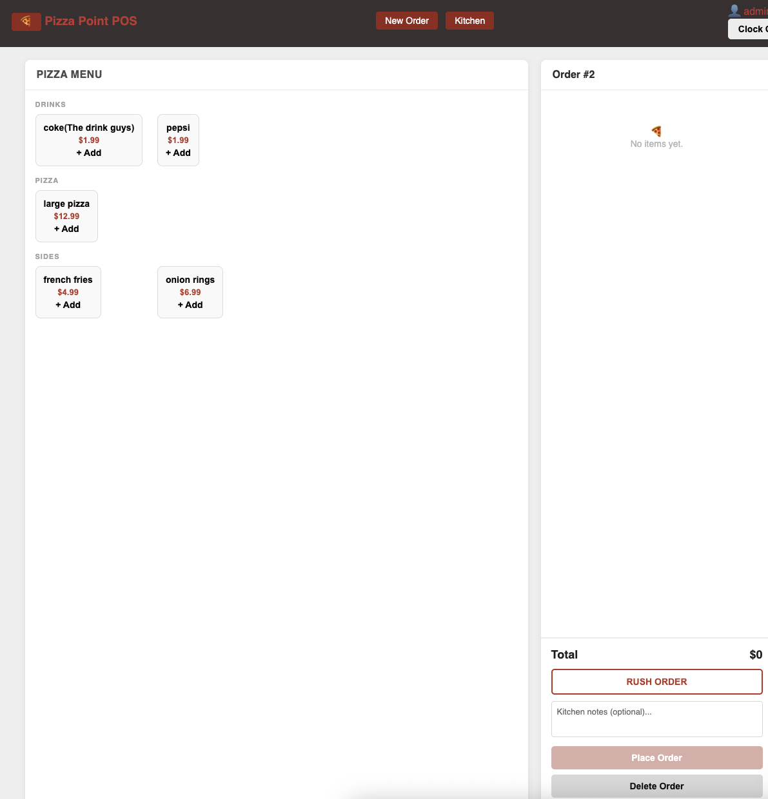

# 🍕 Pizza Point POS

##  
[Launch App](https://pizza-poin-e35c51af1aa9.herokuapp.com/)

---

>A modern Point of Sale web application built for pizza shops — allowing staff to take customer orders, send them to the kitchen, and manage the full order flow in one place.

Pizza point POS provides full **CRUD functionality** (Create, Read, Update, Delete) so users can easily manage orders through a clean and intuitive interface.

---

## ✨ Features

- **Full CRUD Functionality**
  - ➕ Create new order
  - 👀 View orders sent to kitchen
  - ✏️ Edit existing orders information
  - 🗑️ Delete orders from your kitchen when complete 
- **User-Friendly Interface**
  - Clean, modern UI with smooth hover effects
- **Dynamic Updates**
  - Changes update instantly without refreshing the page
- **Responsive Design**
  - Works on desktop, tablet, and mobile devices
- **User-Based Data**
  - Each user manages their own orders

---

## 🛠 How to Use

1. Sign up or sign in to your account
2. Navigate to the dashboard
3. Start taking orders
4. View all orders sent to kitchen 
5. Edit or delete orders as needed

---

## Other resourese used 
* [Figma](https://www.figma.com/make/?gclsrc=aw.ds&&utm_source=google&utm_medium=cpc&utm_campaign=21284800681&utm_term=figma&utm_content=766100984546&utm_adgroup=169015407344&gad_source=1&gad_campaignid=21284800681&gbraid=0AAAAACTf0kPqWNpUxg3tlMOx_IYzf6QKN&gclid=Cj0KCQiAvtzLBhCPARIsALwhxdpQVOr-av0wDBYQzPY6lRnCdye5C03VQQhQDg5a8RWq8KhdnN_w7EEaAqfFEALw_wcB)
* ChatGpt for debugging
---

## Furture Enhancements
- Order history and reporting
- Multiple open tables at once
- Printer / receipt support
- Menu item images
- Role-based access (manager vs staff)
---

 ## Technologies Used
- **Backend:** Python, Django
- **Database:** SQLite
- **Frontend:** HTML, CSS (no frameworks)
- **Auth:** Django's built-in authentication 
 ---